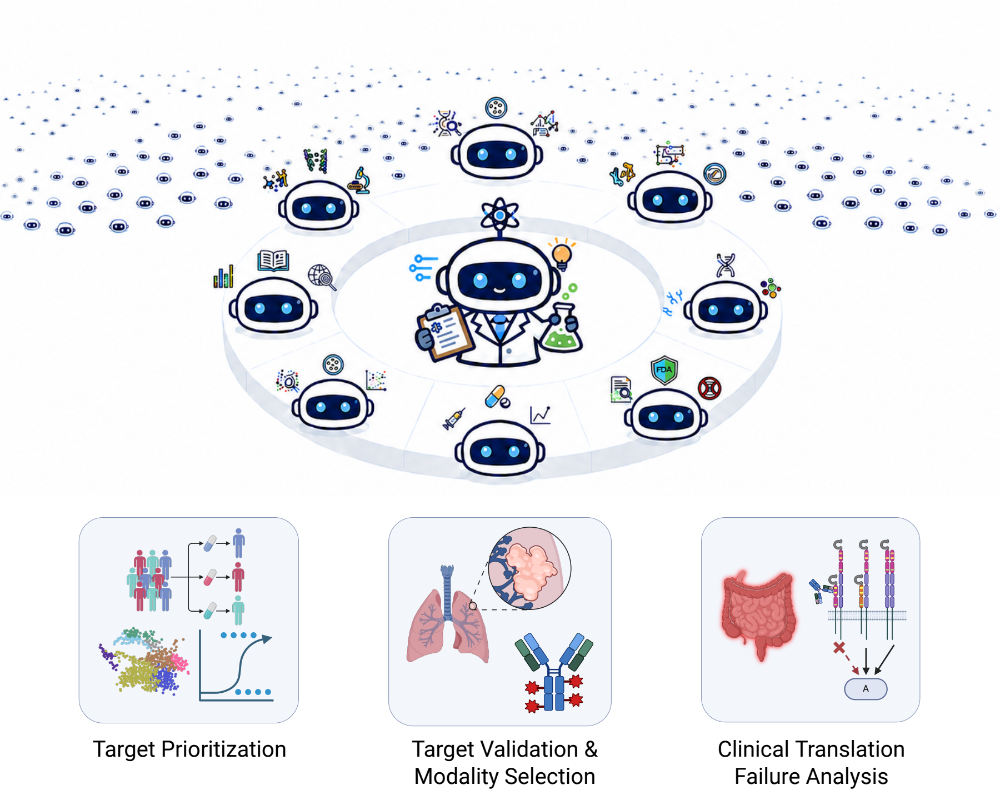

# The Virtual Biotech

The Virtual Biotech uses a Chief Scientific Officer (CSO) agent and a team of
specialists to investigate drug targets. Built on the Claude Agent SDK, it
combines biomedical databases and analysis tools for target identification
and due diligence.

The **interactive CLI is the recommended starting point**. Follow the
[Quickstart](QUICKSTART.md) for installation and two CLI examples.

[](docs/figures/figure0.pdf)

[Setup](#setup) · [CLI](#running-the-cli) · [Web interface (optional)](#running-gradio) · [Architecture](#architecture) · [Apptainer](#apptainer-linux-cluster-only)

## Setup

### 1. Create the conda environment

Install Git and [Miniforge (Conda)](https://github.com/conda-forge/miniforge#install).
Use a terminal where `conda` is available, or the Miniforge Prompt on Windows.
If activation asks for shell initialization, run `conda init` and reopen the
terminal.

```bash
git clone https://github.com/harrisongzhang/TheVirtualBiotech.git
cd TheVirtualBiotech
conda env create -f environment.yml
conda activate vbt
```

Run the remaining commands from the repository root. Activate `vbt` in each new
terminal before running Python. The environment includes Python 3.11, the CLI
and MCP dependencies, scanpy, anndata, CELLxGENE Census, and R integration.
The SDK bundles the Claude Code CLI used for live research.

To update an existing `vbt` environment:

```bash
conda env update --name vbt --file environment.yml
```

<details>
<summary>Check R integration</summary>

Conda activation makes R available to `rpy2`. Check that R and its required
packages load:

```bash
python -c "from rpy2.robjects import r; print(r('R.version.string')[0]); r('library(lme4); library(lmerTest)')"
```

On Linux, the explicit `libopenblas` dependency supplies `libopenblas.so.0` for
`rpy2`, including when Conda selects MKL for other BLAS packages.

</details>

<details>
<summary>If the SDK reports CLINotFoundError</summary>

The pinned `claude-agent-sdk` wheels include the CLI and use that copy ahead
of anything on `PATH`. A separate installation is normally unnecessary.
If the binary is missing, for example after installing the SDK from a source
distribution, install the CLI with:

```bash
curl -fsSL https://claude.ai/install.sh | bash
```

This native installer does not require Node.js. See Anthropic's
[setup guide](https://code.claude.com/docs/en/setup) for other installation methods.
The audit tooling, tests, and `verify` do not need the CLI.

</details>

### 2. Obtain the data

#### Open Targets (required)

Use the archived [Open Targets Platform 25.09 release](https://ftp.ebi.ac.uk/pub/databases/opentargets/platform/25.09/output/),
the version used to build and test this system. The downloader retrieves its
3,508 Parquet files across 38 datasets, preserving the directory layout:

```bash
python tools/download_open_targets.py /path/to/open_targets --workers 8
```

```text
/path/to/open_targets/
├── target/
├── credible_set/
├── evidence/
├── drug_molecule/
└── ...
```

No API key is needed. Rerun the same command to resume an interrupted download,
or add `--list-only` to inspect the inventory without downloading files.
The downloader announces discovery immediately and reports progress every
10 seconds during transfer and verification.

<details>
<summary>Download progress and integrity checks</summary>

Progress reports show validated files, bytes in active transfers (including
resumed bytes), bytes received during this invocation (including retries),
and elapsed time. Files count as validated after their transfer and checks
finish.

The downloader checks transfer completeness and Parquet header/footer markers.
It records sizes and SHA-256 hashes in a local manifest, then uses that manifest
to verify completed files on subsequent runs.

</details>

Resource use measured on Linux x86_64 on 15 September 2026:

| Resource | Measurement |
|---|---|
| Open Targets archive | 28.99 GiB |
| Installed Conda environment | About 5.4 GiB |
| Largest process in target/DepMap test queries | About 9.8 GiB resident RAM |
| Download time | About 28 minutes, with 8 then 16 workers, including an interruption/resume test |

Allow additional disk space for package caches and research outputs. Loaded
tables can use substantially more RAM than their compressed files, and
concurrent specialist queries increase memory use. These measurements describe
the test workload; requirements and download times depend on the machine,
connection, and analysis.

#### Tahoe-100M (optional)

Tahoe adds drug-perturbation tools using pseudobulk differential-expression
results from the [official Tahoe-100M dataset](https://huggingface.co/datasets/tahoebio/Tahoe-100M).
Follow the [download and preparation recipe](docs/TAHOE_SETUP.md), then set
`TAHOE_DATA_PATH` to the prepared directory.

The recipe pins the source revision and uses `tools/prepare_tahoe.py` to create
the filtered files the loader expects. It documents the adjusted-p-value and
log2-fold-change thresholds. DepMap essentiality tools work without Tahoe.

### 3. Set environment variables

Copy the configuration template, then edit `.env` in the project root:

```bash
cp .env.example .env
```

On Windows Command Prompt, use `copy .env.example .env`. Set your key and
absolute data path:

```dotenv
ANTHROPIC_API_KEY="your-anthropic-api-key"
OPEN_TARGETS_DATA_PATH="/absolute/path/to/open_targets"
```

The app loads `.env` automatically, and Git ignores the file. Quoted values
are supported. Exported shell variables take precedence, including explicitly
empty values.

| Variable | Purpose | Required or default |
|---|---|---|
| `ANTHROPIC_API_KEY` | Model access | Required for live research |
| `OPEN_TARGETS_DATA_PATH` | Downloaded Open Targets directory; read-only | Required |
| `TAHOE_DATA_PATH` | Prepared Tahoe directory; read-only | Optional |
| `MCP_OUTPUT_DIR` | Writable directory for MCP outputs, such as query-result Parquet files | Created automatically; defaults to `data/` in the project root |

The data directories contain reference files you download. `MCP_OUTPUT_DIR`
starts empty and is created and populated by the app. Optional `.env` entries:

```dotenv
TAHOE_DATA_PATH="/absolute/path/to/tahoe-prepared"
MCP_OUTPUT_DIR="/absolute/path/to/mcp_outputs"
```

Web-specific settings are covered under [Running Gradio](#running-gradio).

<details>
<summary>Using shell variables instead of .env</summary>

The examples above are file entries. In Bash, export variables with:

```bash
export ANTHROPIC_API_KEY="your-anthropic-api-key"
export OPEN_TARGETS_DATA_PATH="/absolute/path/to/open_targets"
```

</details>

### 4. Configure the MCP servers and check setup

```bash
python setup_mcp.py
python tools/doctor.py --skip-api-key --smoke
```

`setup_mcp.py` configures 12 servers and writes `mcp_config.json` for the active
interpreter and checkout. Git ignores this machine-specific file. Regenerate
it after moving the checkout, changing environments, or switching to Apptainer.

The doctor checks dependencies, all 38 reference-data directories, file
readability and sizes, the download manifest when present, and MCP paths.
With `--smoke`, it also reads one disease record and initializes all 12 servers.
This local check does not load the large analysis tables or call a model or
external data API.

After adding your key, run `python tools/doctor.py` to check key presence too.
A pass does not validate authentication or billing. To recheck data hashes,
rerun the downloader; the doctor checks layout and sizes.

On systems with Bash, `./run.sh doctor --skip-api-key --smoke` also activates
the environment. To use a separate environment:

```bash
VBT_ENV=/absolute/path/to/env ./run.sh doctor --skip-api-key --smoke
```

For custom activation, see the `activate.local.sh` override described in
`activate.sh`. Run the regression tests without model requests:

```bash
python -m unittest discover -s tests
```

## Running the CLI

Research queries require the configured API key and reference data and incur
model API charges. After [setup](#setup), start the recommended interactive CLI
from the repository root:

```bash
conda activate vbt
python run.py
```

At the `You:` prompt, enter:

```text
Evaluate PCSK9 as a target for lowering LDL cholesterol, including genetic evidence and existing therapies.
```

Ask follow-up questions in the same session, then type `/done` to save and exit.
For a single query that exits when finished:

```bash
python run_vbt.py run "Evaluate PCSK9 as a target for lowering LDL cholesterol, including genetic evidence and existing therapies."
```

Both examples use the default model. See the
[quickstart examples](QUICKSTART.md#two-cli-examples) for the same workflow.

| Interface | Command | Output directory |
|---|---|---|
| Interactive terminal (recommended) | `python run.py` | `sessions/<timestamp>/` |
| Headless question or conversation | `python run_vbt.py run "<query>"` | `runs/<RUN_ID>/` |
| Headless with Bash activation | `./run.sh run "<query>"` | `runs/<RUN_ID>/` |

Use the Python entry points after activating the environment and configuring
MCP servers in [setup](#setup). `run.sh` handles activation and MCP configuration
automatically.

### Choose a model

Model selection is optional. Both CLIs accept model IDs and quoted display labels:

```bash
python run.py --model claude-opus-4-6
./run.sh run --model claude-opus-4-6 "Evaluate PCSK9 as a target for lowering LDL cholesterol, including genetic evidence and existing therapies."
# --model "Opus 4.6" selects the same model.
```

The default is `claude-sonnet-4-5-20250929`. The chief-of-staff and
scientific-reviewer always use Haiku. To see the labels and options, use
`python run.py --help` or `python run_vbt.py run --help`.

Unrecognized labels fail immediately. Model IDs beginning with `claude-` are
forwarded unchanged; Anthropic returns an API error for unavailable models.
See the [model catalog](https://platform.claude.com/docs/en/about-claude/models/overview).

### Interactive sessions

Run `python run.py`, then type a question at the `You:` prompt. For multi-line
input, enter a line containing `"""`, your question, and another `"""` line.

| Command | Action |
|---|---|
| `/summary` | Show per-turn cost and agent breakdown |
| `/done` | Save the session and exit |
| `/help` | Show available commands |
| `Ctrl+C` | Exit gracefully and save output files |

Sessions write `session_report.json`, `transcript.md`, `trace.jsonl`, and agent
files under `workspace/` inside `sessions/<timestamp>/`.

### Headless runs

Pass one quoted argument per conversation turn, or use `-f questions.txt` for
one turn per nonempty line. The runner prints the run ID and paths to its
`README.md` and `audit.html`.

Research artifacts go in `runs/<RUN_ID>/work/`; logs and evidence have their own
subdirectories. Check the recorded artifacts with `./run.sh verify <RUN_ID>`.
Headless and web runs share the `runs/` layout; interactive sessions use `sessions/`.

## Running Gradio

The web interface is optional. To use it, set a shared access password in `.env`:

```dotenv
BIOTECH_APP_PASSWORD="choose-your-own"
```

This password is required for the web interface; the CLI does not use it.
Gradio verifies it before serving the interface or accepting research requests.
Start the web interface with:

```bash
conda activate vbt
python setup_mcp.py
python gradio_cso_app.py
```

Open `http://127.0.0.1:7860` and sign in with any username and your configured
password. The server binds to localhost. Research requests use the API key
and reference data configured in [setup](#setup).

If port 7860 is occupied, add this entry to `.env` and restart:

```dotenv
GRADIO_SERVER_PORT="17860"
```

Then open `http://127.0.0.1:17860`. From Bash, you can set the port for a single
launch with `GRADIO_SERVER_PORT=17860 python gradio_cso_app.py`. The wrapper
`./run.sh web` activates the environment, configures MCP servers, and starts
the same interface.

## Architecture

### Specialist agents

The CSO delegates directly to these specialists:

| Agent | Role | Data sources |
|---|---|---|
| `genomics-analyst` | GWAS, L2G, QTL colocalization | Open Targets Genetics |
| `functional-genomics-analyst` | CRISPR essentiality, DepMap (cancer only) | DepMap, Tahoe |
| `single-cell-analyst` | Cell-type expression, scRNA-seq | CELLxGENE Census |
| `fda-safety-officer` | Drug warnings, adverse events, mouse phenotypes | Open Targets |
| `bio-pathways-ppi-analyst` | Reactome pathways, GO, protein interactions | Reactome, STRING |
| `clinical-trialist` | Clinical trials, cancer genomics | ClinicalTrials.gov, cBioPortal |
| `target-biologist` | Druggability, protein structure, localization | Open Targets, GTEx |
| `medchem-pharmacologist` | Drug development, modality ranking | ChEMBL, Open Targets |
| `chief-of-staff` | Web intelligence, field overview | WebSearch, WebFetch |
| `scientific-reviewer` | Quality assurance, rigor review | (read-only) |

### MCP servers

Twelve MCP servers provide access to biomedical data and the run's evidence records:

| Server | Data source |
|---|---|
| `expression` | GTEx bulk RNA-seq expression |
| `genetics` | Open Targets Genetics (GWAS, L2G, QTL) |
| `target` | Open Targets target annotations and druggability |
| `drug` | Open Targets drug mechanisms and safety |
| `disease` | Open Targets disease ontology |
| `association` | Open Targets target-disease associations |
| `single_cell` | CELLxGENE Census |
| `functional_genomics` | DepMap CRISPR essentiality + Tahoe drug perturbations |
| `pathway` | Reactome pathways + Gene Ontology |
| `interaction` | Protein-protein interaction networks |
| `clinicaltrials` | ClinicalTrials.gov + cBioPortal cancer genomics |
| `provenance` | Run claims, artifacts, analysis plans, and evidence records |

## Apptainer (Linux cluster only)

`vbt.def` builds a self-contained image with the Conda environment. Apptainer
requires Linux; the [Conda setup](#setup) has also been tested on macOS and
Windows.

The source checkout stays on the host and is bind-mounted at runtime, so code
updates do not require rebuilding the image.

### Build

Run from the repository root:

```bash
apptainer build vbt.sif vbt.def
```

### Run

Use `apptainer exec` with `--pwd` set to the mounted project directory.
`apptainer run` is not the application entry point. Configure MCP servers inside
the container first so their absolute interpreter and script paths match:

```bash
apptainer exec \
  --bind /path/to/project:/workspace \
  --bind /path/to/open_targets:/data/open_targets \
  --pwd /workspace \
  vbt.sif python setup_mcp.py

apptainer exec \
  --bind /path/to/project:/workspace \
  --bind /path/to/open_targets:/data/open_targets \
  --pwd /workspace \
  vbt.sif python run.py
```

Regenerate `mcp_config.json` whenever you switch between Conda and the container.
Pass API keys and data paths with `--env`, or place a `.env` file in the mounted
project directory at `/workspace`. Use paths as seen inside the container.
The SDK's CLI is bundled in the image's Python environment and does not depend
on the host's `PATH` or `$HOME`.

### Test the image

```bash
apptainer test vbt.sif
```

## License

MIT License. See [LICENSE](LICENSE) for details.
